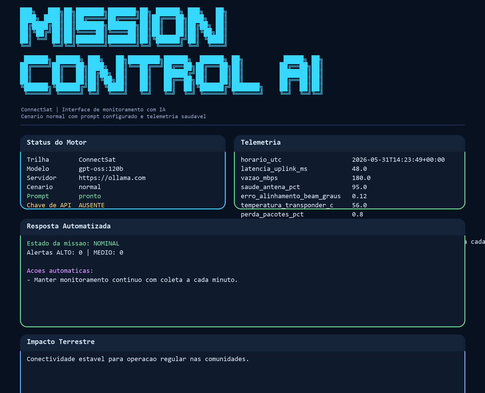
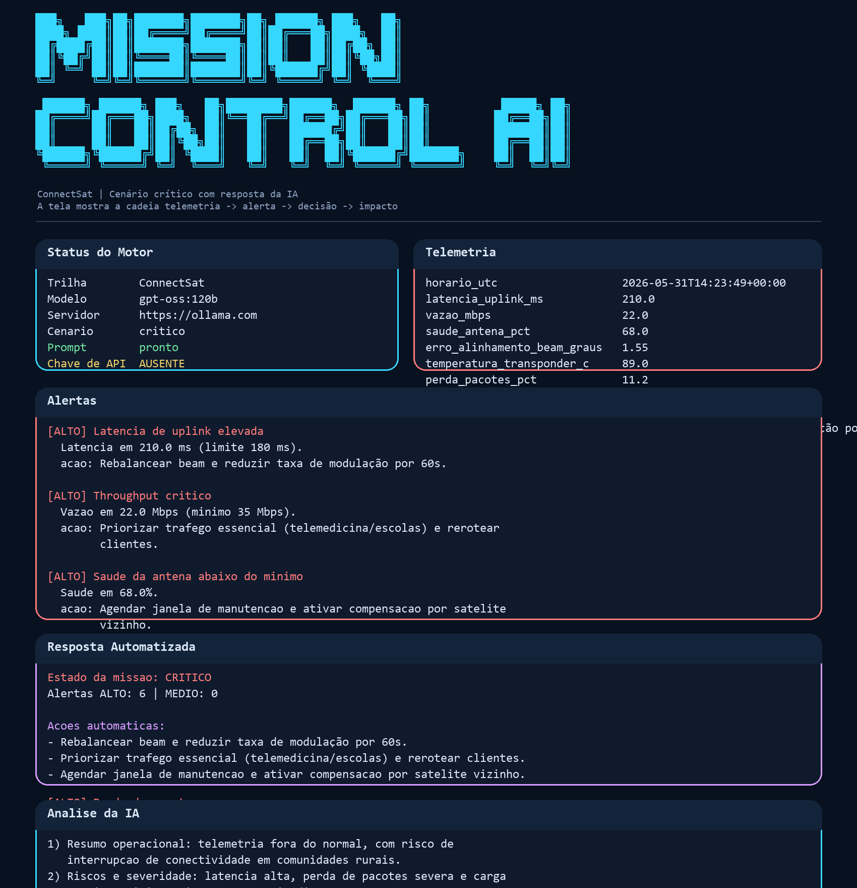

# Mission Control AI - ConnectSat

## Integrantes
- [Preencher nome] - RM: [Preencher RM] - Turma: [Preencher turma]
- [Preencher nome] - RM: [Preencher RM] - Turma: [Preencher turma]

## Modalidade
- [Individual | Dupla | Trio]

## O que o projeto faz
O Mission Control AI simula a operação de um satelite de telecomunicacoes da trilha ConnectSat. O sistema gera telemetria, detecta anomalias com regras Python e usa Ollama Cloud ou Ollama local para explicar o estado da missao em linguagem natural, destacando o impacto sobre conectividade rural, telemedicina e escolas.

## Persona atendida
Operador de NOC de uma operadora de conectividade rural. A interface foi pensada para leitura rapida de status tecnico, priorizacao de incidentes e traducao do risco orbital em consequencias praticas na Terra.

## Tecnologias utilizadas
- Python 3.10+
- Ollama Cloud API ou Ollama local
- `ollama==0.6.2`
- `python-dotenv==1.2.2`
- `rich==15.0.0`
- `prompt-toolkit==3.0.52`
- `pyfiglet==1.0.4`

## Estrutura do projeto
```text
mission-control-ai/
├── main.py
├── banner_ascii.py
├── requirements.txt
├── prompts/system_prompt.md
├── data/cenarios.json
├── assets/
└── src/
    ├── alertas.py
    ├── engine.py
    ├── telemetria.py
    └── ui.py
```

## Como executar
1. Clone o repositório.
2. Crie e ative um ambiente virtual.
3. Instale as dependencias:
   - `pip install -r requirements.txt`
4. Crie um arquivo `.env` na raiz com:
   - para cloud: `OLLAMA_API_KEY=sua_chave_aqui_sem_aspas`
   - para local: `OLLAMA_LOCAL_MODEL=llama3.2`
   - opcional: `OLLAMA_MODEL=gpt-oss:120b`
   - opcional: `OLLAMA_HOST=https://ollama.com`
   - opcional: `OLLAMA_LOCAL_HOST=http://localhost:11434`
5. Execute:
   - `python main.py`

## Comandos da CLI
- `ajuda` ou `/help`
- `status` ou `/status`
- `telemetria`
- `alertas`
- `cenario <normal|latencia|critico|apagao>`
- `resposta`
- `impacto`
- `analisar <pergunta>`
- `sair` ou `/exit`

## Prints reais
Os arquivos abaixo mostram a aplicacao rodando com telemetria normal e com um cenario critico:




## System prompt
O prompt usado pela IA esta em `prompts/system_prompt.md`. Ele orienta a resposta para:
- resumo operacional objetivo
- riscos e severidade
- acao imediata recomendada
- impacto terrestre esperado

## Proposta de valor / modelo de negocio
O problema real resolvido e a continuidade de internet em areas sem fibra. Quando a missao opera bem, escolas rurais, postos de saude e pequenos negocios mantem conectividade estavel, reduzindo interrupcoes em telemedicina e educacao remota.

Quem paga pela solucao pode ser um modelo hibrido: operadoras de telecom, programas publicos de inclusao digital e clientes corporativos que precisam de cobertura em regioes remotas. A medicao de impacto pode ser feita por tempo de disponibilidade, numero de escolas atendidas e reducao de incidentes de conexao em periodos criticos.

O modelo de negocio se encaixa bem como assinatura de monitoramento e dado-como-servico, com relatórios operacionais para NOC, gestao de rede e equipe de campo.

## Limitações conhecidas
- A telemetria ainda e simulada.
- Nao existe persistencia em banco.
- Nao ha testes automatizados.
- A resposta da IA depende de um modelo instalado localmente ou de uma chave valida da Ollama Cloud.

## Vídeo de demonstração
- Adicionar aqui o link do YouTube nao listado.
- Exemplo: `https://www.youtube.com/watch?v=SEU_ID_AQUI`
